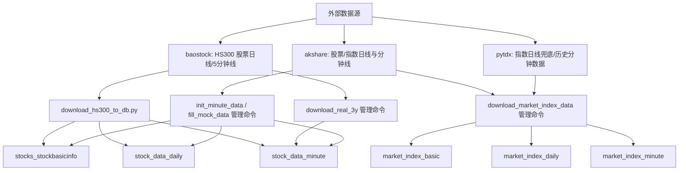
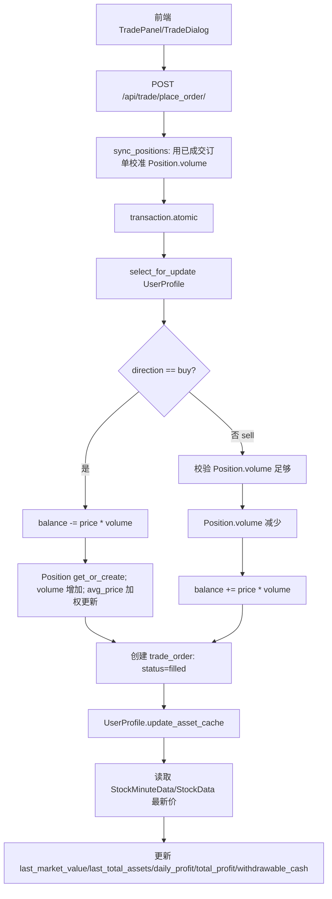
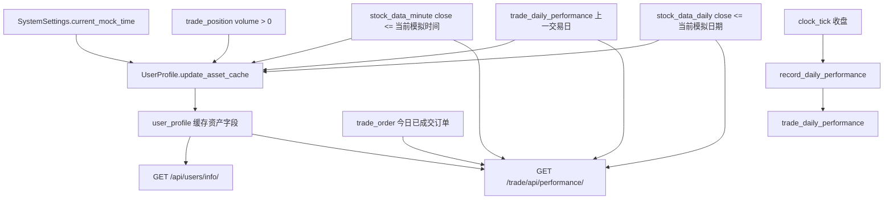

# 数据库模型与核心数据流

本文档只基于当前代码整理，用于后续 agent 排查数据问题。后端是 Django 4.2，数据库配置在 `quant_backend/quant_backend/settings.py`，默认连接 MySQL `quant_db`，`DEFAULT_AUTO_FIELD = "django.db.models.BigAutoField"`，未显式声明主键的模型均有隐式 `id` 主键。

## 数据库配置

| 项 | 当前值 | 代码位置 |
| --- | --- | --- |
| ENGINE | `django.db.backends.mysql` | `quant_backend/quant_backend/settings.py` |
| NAME | `quant_db` | `quant_backend/quant_backend/settings.py` |
| HOST | `127.0.0.1` | `quant_backend/quant_backend/settings.py` |
| PORT | `3306` | `quant_backend/quant_backend/settings.py` |
| TIME_ZONE | `UTC` | `quant_backend/quant_backend/settings.py` |
| USE_TZ | `True` | `quant_backend/quant_backend/settings.py` |

## stocks app 模型

| 模型 | db_table | 字段 | 字段用途 | 索引与约束 | 主要读写位置 |
| --- | --- | --- | --- | --- | --- |
| `StockData` | `stock_data_daily` | `code`, `date`, `open`, `high`, `low`, `close`, `volume`, `amount` | 股票日线 OHLCV 和成交额；用于日 K、涨跌幅、策略因子、回测 | `Index(fields=['code', 'date'])`；无 `unique` 约束 | 写：`download_hs300_to_db.py`、`init_minute_data`、`fill_mock_data`；读：`stocks/views.py`、`trade/views.py`、`trade/executor.py`、`backtest/engine.py` |
| `StockMinuteData` | `stock_data_minute` | `code`, `date`, `open`, `high`, `low`, `close`, `volume`, `amount` | 股票分钟线，代码中按 5 分钟线使用；用于分时图、实时市值、日内收益 | `Index(fields=['code', 'date'])`；无 `unique` 约束 | 写：`download_hs300_to_db.py`、`download_real_3y`、`init_minute_data`、`fill_mock_data`；读：`stocks/views.py`、`users/models.py`、`trade/views.py`、`trade/tasks.py` |
| `StockBasicInfo` | `stocks_stockbasicinfo` | `code`, `name` | 股票代码与名称映射 | `code` 是 `unique=True` | 写：导入脚本与初始化命令；读：行情列表、订单/持仓序列化、自选股、回测结果名称映射 |
| `MarketIndexBasicInfo` | `market_index_basic` | `code`, `name`, `market` | 大盘指数代码、名称、交易所 | `code` 是 `unique=True` | 写：`download_market_index_data`；读：`get_market_index_list_api`、`get_market_index_data_api` |
| `MarketIndexDailyData` | `market_index_daily` | `code`, `date`, `open`, `high`, `low`, `close`, `volume`, `amount`, `amplitude`, `change_pct`, `change_amount`, `turnover_rate`, `source` | 大盘指数日线与涨跌指标 | `Index(fields=['code', 'date'])`；`UniqueConstraint(fields=['code', 'date'], name='uniq_market_index_daily')` | 写：`download_market_index_data`；读：指数概览和指数 K 线接口 |
| `MarketIndexMinuteData` | `market_index_minute` | `code`, `date`, `open`, `high`, `low`, `close`, `volume`, `amount`, `source` | 大盘指数 5 分钟线 | `Index(fields=['code', 'date'])`；`UniqueConstraint(fields=['code', 'date'], name='uniq_market_index_minute')` | 写：`download_market_index_data`；读：指数 K 线接口 |

## users app 模型

项目使用 Django 内置 `auth.User`，数据库表通常是 `auth_user`。`users` app 只定义扩展资料和自选股。

| 模型 | db_table | 字段 | 字段用途 | 索引与约束 | 主要读写位置 |
| --- | --- | --- | --- | --- | --- |
| `UserProfile` | `user_profile` | `user`, `phone`, `avatar`, `balance`, `withdrawable_cash`, `initial_capital`, `last_market_value`, `last_total_assets`, `daily_profit`, `total_profit`, `last_update_time` | 用户钱包、初始本金、资产缓存和头像手机号 | `user` 是 `OneToOneField(User)`；一名用户一条 profile | 写：注册、资金划转、下单、策略撮合、`update_asset_cache()`、系统重置；读：用户信息、资产图、下单校验 |
| `UserFavorite` | `user_favorite` | `user`, `stock`, `add_time` | 用户自选股；`stock` 指向 `stocks.StockBasicInfo.code` | `unique_together = ('user', 'stock')` | 写：`UserFavoriteView.post/delete`；读：`UserFavoriteView.get`、`UserFavoriteSerializer` |

## trade app 模型

| 模型 | db_table | 字段 | 字段用途 | 索引与约束 | 主要读写位置 |
| --- | --- | --- | --- | --- | --- |
| `Strategy` | `trade_strategy` | `stock_pool`, `total_return`, `create_time`, `user`, `name`, `code`, `status` | 用户策略配置；`code` 存策略 JSON/代码文本；`status` 控制是否运行 | `user` 外键到 `auth.User`；无显式索引 | 写：`StrategyView`；读：`TradingEngine.run_all_active_strategies()`、前端策略列表 |
| `Position` | `trade_position` | `user`, `stock_code`, `volume`, `avg_price`, `frozen_volume` | 用户当前持仓数量、均价和冻结股数 | `unique_together = ('user', 'stock_code')` | 写：手动下单、策略撮合、`sync_positions()`；读：资产计算、持仓列表、策略卖出逻辑 |
| `Order` | `trade_order` | `user`, `strategy`, `stock_code`, `direction`, `price`, `volume`, `status`, `order_time` | 委托订单；当前手动下单和策略撮合都直接写 `filled` | `user` 外键；`strategy` 可空外键到 `Strategy` | 写：`PlaceOrderView`、`TradingEngine.execute_strategy()`；读：订单列表、持仓同步、收益回放 |
| `TradeRecord` | `trade_record` | `order`, `stock_code`, `price`, `volume`, `amount`, `fee`, `trade_time` | 成交记录；策略撮合会写入，手动下单当前只写 `Order` | `order` 是 `OneToOneField(Order)` | 写：`TradingEngine.execute_strategy()`；读：`trade/utils.py` 的交易回放 |
| `DailyPerformance` | `trade_daily_performance` | `user`, `date`, `total_assets`, `day_profit`, `day_return_rate`, `total_return_rate` | 收盘级用户资产与收益曲线 | `unique_together = ('user', 'date')` | 写：`record_daily_performance()`、`trade/utils.py`；读：`PerformanceView`、`UserProfile.update_asset_cache()` |
| `IntradayPerformance` | `trade_intraday_performance` | `user`, `time`, `total_assets`, `total_return_rate` | 日内 5 分钟资产快照 | `Index(fields=['user', 'time'])` | 写：`record_intraday_snapshot()`、`trade/utils.py`；当前前端日内收益主要由 `PerformanceView` 实时计算 |
| `SystemSettings` | `system_settings` | `current_mock_time`, `time_speed`, `last_update_time` | 系统模拟时间和时间流速 | 代码通过 `get_settings()` 固定使用 `id=1`；无显式唯一约束 | 写：`clock_tick()`、`SystemControlView`、`set_mock_now()`；读：行情接口、交易接口、资产计算 |
| `TimeFlowSettings` | 不建表 | proxy of `SystemSettings` | admin 中安全调整流速 | `proxy = True` | Django admin |
| `TimeResetSettings` | 不建表 | proxy of `SystemSettings` | admin 中危险时间穿越/重置 | `proxy = True` | Django admin |

## backtest app 模型

| 模型 | db_table | 字段 | 字段用途 | 索引与约束 | 主要读写位置 |
| --- | --- | --- | --- | --- | --- |
| `Factor` | `backtest_factor` | `name`, `code`, `description`, `is_active` | 因子元数据 | `name` 和 `code` 均为 `unique=True` | 当前业务代码未明显读写，预留模型 |
| `BacktestTask` | `backtest_task` | `user`, `task_name`, `start_date`, `end_date`, `initial_capital`, `status`, `factor_weights`, `created_at`, `updated_at`, `error_message` | 回测任务参数、状态、错误信息 | `user` 外键；无显式索引 | 写：`RunBacktestView.post`；读：`BacktestResult.task` 关联 |
| `BacktestResult` | `backtest_result` | `task`, `annualized_return`, `max_drawdown`, `sharpe_ratio`, `win_rate`, `equity_curve`, `positions_history` | 回测指标、资金曲线、持仓/交易历史 JSON | `task` 是 `OneToOneField(BacktestTask, related_name='result')` | 写：`RunBacktestView.post`；返回给前端回测页 |

## 核心数据流

### 行情数据如何进入数据库



股票数据有两类入口：根目录脚本 `quant_backend/download_hs300_to_db.py` 和 `stocks/management/commands/*`。`download_hs300_to_db.py` 会先把 HS300 基本信息、日线和 5 分钟线下载到 `raw_data/hs300_cache`，再上传数据库，并用 `raw_data/hs300_cache/state.json` 做断点状态。

指数数据由 `python manage.py download_market_index_data` 写入专用指数表。日线优先 AkShare，失败时尝试 pytdx 兜底；分钟线从 pytdx 历史分钟数据聚合成 5 分钟 K 线。

### 前端如何读取行情

```mermaid
flowchart TD
    F1[MarketView.vue] --> A1[GET /stocks/api/market/]
    F2[StockDetailView.vue] --> A2[GET /stocks/api/data/:stock_code/?freq=daily|min]
    F3[MarketIndexBoard.vue] --> A3[GET /stocks/api/indices/]
    F4[MarketIndexDetailView.vue] --> A4[GET /stocks/api/index/:index_code/?freq=daily|min]
    A1 --> S1[StockBasicInfo]
    A1 --> S2[StockMinuteData 优先]
    A1 --> S3[StockData 兜底]
    A2 --> S2
    A2 --> S3
    A3 --> I1[MarketIndexBasicInfo]
    A3 --> I2[MarketIndexDailyData]
    A4 --> I2
    A4 --> I3[MarketIndexMinuteData]
    T[SystemSettings.current_mock_time] --> A1
    T --> A2
    T --> A3
    T --> A4
```

行情接口都以 `trade.time_utils.get_mock_now()` 读取模拟时间，避免展示“未来数据”。股票详情 `freq=min` 默认取模拟时间之前最近 500 根分钟线；`freq=daily` 取模拟日期之前最近 500 根日线。行情列表对每只股票优先找模拟时间之前最近分钟线，找不到再使用日线。

### 用户下单后数据如何变化



手动下单当前不会创建 `TradeRecord`，只创建 `Order(status='filled')` 并直接更新 `Position` 与 `UserProfile.balance`。策略撮合路径在 `TradingEngine.execute_strategy()` 中会同时创建 `Order` 和 `TradeRecord`。

### 收益/资产如何计算



`UserProfile.update_asset_cache()` 是顶部资产卡片的核心计算函数。它遍历当前持仓，优先取 `StockMinuteData(code, date<=current_mock_time)` 最近收盘价，没有分钟线则取 `StockData(code, date<=current_mock_time.date())` 最近收盘价，再没有则退回持仓均价。公式是 `last_market_value = sum(volume * price)`，`last_total_assets = balance + last_market_value`，`total_profit = last_total_assets - initial_capital`。

日收益优先用 `DailyPerformance` 中当前日期之前的最近一条 `total_assets` 做基准；如果没有历史记录，`daily_profit = total_profit`。`withdrawable_cash` 当前直接等于 `balance`。

`PerformanceView` 的 `type=daily` 读取 `DailyPerformance`，如果当天没有记录会调用 `calculate_asset_status()` 动态补一条返回给前端但不一定落库。`type=intraday` 不直接依赖 `IntradayPerformance` 表，而是读取今日订单、当前持仓和分钟线，按 5 分钟回放计算收益曲线，并在最后调用一次 `profile.update_asset_cache()` 对齐最新点。

## 数据导入脚本和管理命令

| 名称 | 类型 | 写入表 | 数据源 | 特点与风险 |
| --- | --- | --- | --- | --- |
| `quant_backend/download_hs300_to_db.py` | 独立脚本 | `stocks_stockbasicinfo`, `stock_data_daily`, `stock_data_minute` | baostock | 推荐用于 HS300 全量同步；先下载 CSV 再上传；支持 `--skip-download`、`--skip-upload`、`--force-download`、`--force-upload`；强制上传会按代码和日期范围先删后插 |
| `stocks.management.commands.download_market_index_data` | Django 管理命令 | `market_index_basic`, `market_index_daily`, `market_index_minute` | AkShare、pytdx | 用于指数专用表；`--force` 会覆盖对应范围；`--skip-daily`、`--skip-minute` 可分阶段执行 |
| `stocks.management.commands.init_minute_data` | Django 管理命令 | `stocks_stockbasicinfo`, `stock_data_daily`, `stock_data_minute` | AkShare | 只处理代码内固定 5 只股票；交互确认后清空股票基础、日线、分钟线表 |
| `stocks.management.commands.fill_mock_data` | Django 管理命令 | `stocks_stockbasicinfo`, `stock_data_daily`, `stock_data_minute` | AkShare + 模拟补全 | 只处理代码内固定 5 只股票；交互确认后清空表；真实分钟线缺失时用日线生成模拟 5 分钟线 |
| `stocks.management.commands.download_real_3y` | Django 管理命令 | `stock_data_minute` | baostock | 只处理代码内固定 5 只股票；会清空全部 `StockMinuteData`；代码注释说最近 3 年，实际 `start_date = now - 365 * 5` |
| `trade.management.commands.run_scheduler` | Django 管理命令 | APScheduler 任务表、交易相关表 | 内部调度 | 当前代码导入 `run_active_strategies`、`record_intraday_assets`，但 `trade/tasks.py` 中实际函数名是 `clock_tick`、`record_intraday_snapshot`、`record_daily_performance`；直接运行前需先核对 |

常用命令示例：

```bash
cd quant_backend
python manage.py download_market_index_data --start 2022-01-01 --end 2026-05-12
python manage.py download_market_index_data --start 2022-01-01 --skip-minute
python download_hs300_to_db.py --daily-start 2018-01-01 --minute-start 2024-01-01 --end 2026-05-12
python download_hs300_to_db.py --skip-download --force-upload
```

## 常见数据库问题排查

| 现象 | 优先检查 | 代码依据 |
| --- | --- | --- |
| 股票 K 线重复、同一代码同一时间多条 | `stock_data_daily` 和 `stock_data_minute` 只有 `(code, date)` 索引，没有唯一约束；检查导入脚本是否重复 `bulk_create` | `stocks/models.py` |
| 指数 K 线重复插入失败 | 指数日线/分钟线有 `(code, date)` 唯一约束；重复写入会触发唯一约束错误，除非命令先跳过或 `--force` 删除 | `MarketIndexDailyData`、`MarketIndexMinuteData` |
| 前端看不到最新行情 | 检查 `system_settings.current_mock_time` 是否早于数据日期；行情接口只读模拟时间之前的数据 | `stocks/views.py`、`trade/time_utils.py` |
| 分时图为空 | 检查目标日期是否存在 `stock_data_minute`；`PerformanceView(type=intraday)` 若当天完全没有分钟线会直接返回空数组 | `trade/views.py` |
| 资产卡片与收益曲线不一致 | 顶部卡片读 `UserProfile` 缓存并触发 `update_asset_cache()`；日线收益图读 `DailyPerformance`，日内收益图实时回放订单和分钟线 | `users/views.py`、`trade/views.py` |
| 持仓数量异常 | `Position` 是当前态，`sync_positions()` 会用已成交 `Order` 回放校准 `volume`，但只更新 `volume`，不重算 `avg_price` | `trade/views.py` |
| 手动下单没有成交记录 | `PlaceOrderView` 只写 `Order`、`Position`、`UserProfile`，不写 `TradeRecord`；策略撮合才写 `TradeRecord` | `trade/views.py`、`trade/engine.py` |
| 用户余额不足但持仓够 | 买入校验 `UserProfile.balance`；卖出校验 `Position.volume`；`frozen_volume` 字段当前未参与手动下单可用量计算 | `trade/views.py` |
| 系统时间接口报错 | `SystemControlView.get` 返回 `settings.skip_non_trading`，但 `SystemSettings` 模型没有该字段 | `trade/views.py`、`trade/models.py` |
| 调度命令启动失败 | `run_scheduler.py` 引用的任务函数名与 `trade/tasks.py` 不一致 | `trade/management/commands/run_scheduler.py` |
| 注册用户资产初始值不一致 | 注册创建 `balance=200000.00`、`initial_capital=200000.00`，但 `withdrawable_cash` 未显式传入，依赖模型默认 `0.00`，后续 `update_asset_cache()` 会置为 `balance` | `users/serializers.py`、`users/models.py` |

## 快速定位建议

| 要查的问题 | 建议入口 |
| --- | --- |
| 某只股票是否有行情 | 查 `stock_data_daily` / `stock_data_minute` 的 `code`、`date` 范围；再比对 `system_settings.current_mock_time` |
| 某指数是否缺线 | 查 `market_index_daily` / `market_index_minute`，注意 `(code, date)` 唯一约束 |
| 用户总资产为何变化 | 从 `user_profile.balance`、`trade_position`、最近分钟/日线价格开始，再看 `update_asset_cache()` |
| 今日收益为什么跳变 | 查上一条 `trade_daily_performance`，再查今日 `trade_order` 和分钟线 |
| 回测结果为空 | `backtest.engine.load_data()` 只读取 `StockData.values('date', 'code', 'close')`，先确认回测日期范围内有日线数据 |
| 策略未下单 | 检查 `trade_strategy.status='active'`、`stock_pool`、`code` JSON、最近 30 天 `StockData` 是否足够 6 根收盘价 |
